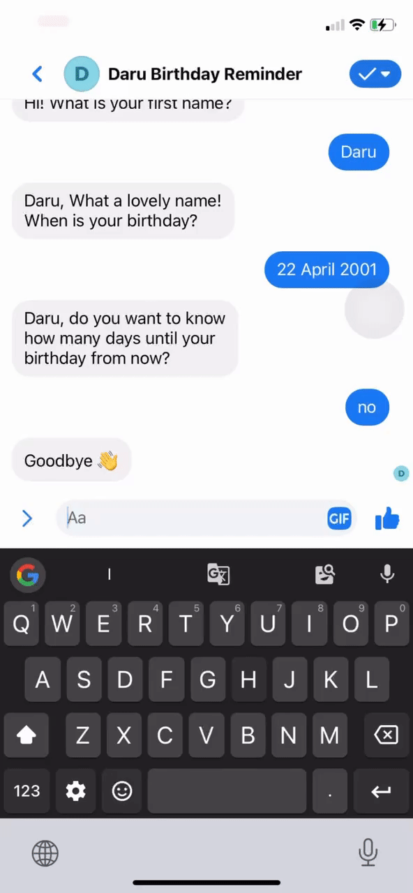
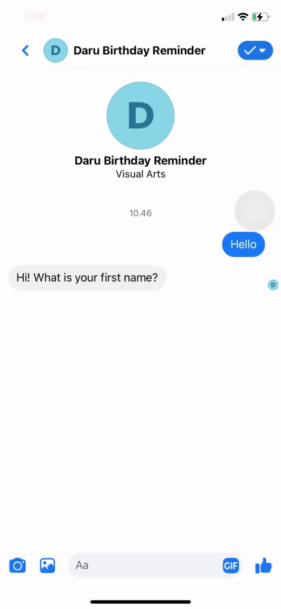
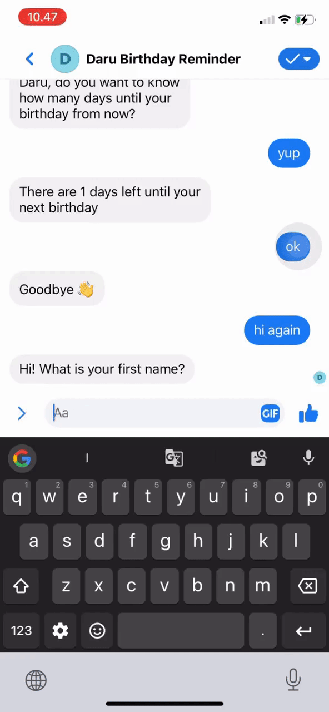

<h1 align="center">Welcome to facebook-messenger-bot 👋</h1>
<p>
  <a href="https://www.npmjs.com/package/facebook-messenger-bot" target="_blank">
    
  </a>
  <a href="#" target="_blank">
    
  </a>
</p>

> Facebook messenger bot for counting days till next birthday

### ✨ [Demo](https://www.facebook.com/Daru-Birthday-Reminder-109260241911509/)

## Install

```sh
npm install

// rename the ".env.example" to ".env"
```

## Usage

```sh
npm run start
```

## Run tests

```sh
npm run test
```

## Bot Demo (GIF)





## Author

👤 **M. Daru Darmakusuma**

- Github: [@mdarud](https://github.com/mdarud)
- LinkedIn: [@Muhammad Daru Darmakusuma](https://linkedin.com/in/muhammad-daru-darmakusuma)
